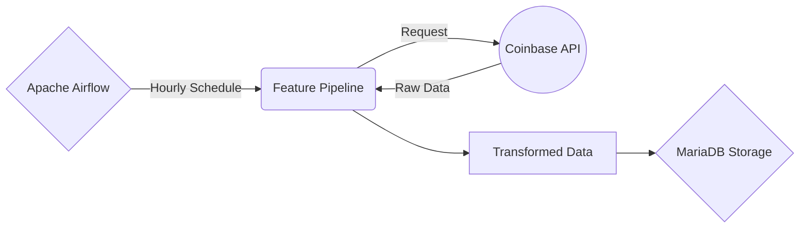
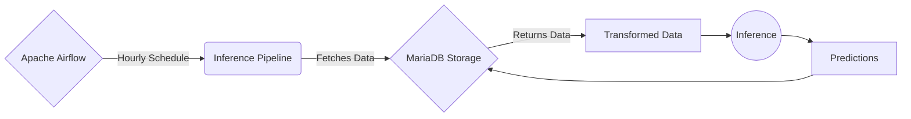
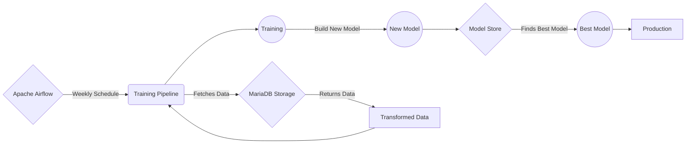

    <h1>BTCUSD Offline Batch Scoring Predictions</h1>
    <i>An Offline End-to-End Machine Learning Service for Predicting BTCUSD Hourly Prices.</i>

 

    Let's connect  on <a href="https://www.linkedin.com/in/andrea-amedeo.serravalle/">LinkedIn</a> 🤗

# Welcome!

Here's an End-to-End Machine Learning Solution for Predicting BTCUSD Crypto Prices on an Hourly Basis through Batch Scoring.

## How does it Work?

Simply put, the whole architecture Relies on a **Monolithic Local Setup** that uses Python, Apache Airflow and MariaDB.

The Core of the Project relies in the **3-Pipelines** approach:

### • The ETL Pipeline - AKA Feature Pipeline

On Every Hour the ETL Pipeline (Scheduled by Airflow) gets triggered and Fetches the Previous Data Point, as we need Closing Prices of the Hour, hence, the last price before the new hour ticks in.
The Fetched Data Point, get Transformed and pushed to a Local MariaDB Database.

### • The Prediction Pipeline - AKA Inference Pipeline

Always on every hour, the Prediction Pipeline gets triggered too and Predicts the Next incoming Data Point with a LightGBM Model.
The Predictions gets then pushed into a different table to the Local MariaDB.

### • The ReTraining Pipeline - AKA Training Pipeline

Every 23:30 of every Sunday, the Retraining Pipeline gets triggered and ReTrains a new model.
This new model, gets stored in a Model Store alongside all the models that have been trained by the Pipeline.
Lastly, the Pipeline, Computes an Error Measurement for every Model in the Store, picks the best one in terms of metrics and pushes it to Production.

# FlowCharts

## Feature Pipeline

## Inference Pipeline

## Training Pipeline

# Moving Online

This Particular System has been Designed with the sole purpose of being an Offline Batch Scoring Service.
However, it can also be deployed online, and here are the best Options for Deploying this System:

1. Triple Communicating Container Architecture (1 for Airflow, 1 for MariaDB, 1 for Python)
	This way development can be more scalable and efficient.
2. Deploy the Architecture as-is into a Server and configure MariaDB for Accepting External Connections.
	By doing this, we can have the Infrastructure Running Locally, but we can access Transformed Data and Predictions from everywhere, and eventually build up from there. (e.g.: A Community Deployed Streamlit Dashboard that Fetches Data Directly from Online MariaDB)
	
3. Deploy the Architecture as-is into a Server and Build an API FastAPI for Serving Both Transformed Data and Predictions.
	Having an API Endpoint to Fetch Data and Predictions, is both the Safer choice in terms of security and the most Scalable and Efficient one, as long as the Server (with the whole Infrastructure) is up and running.
